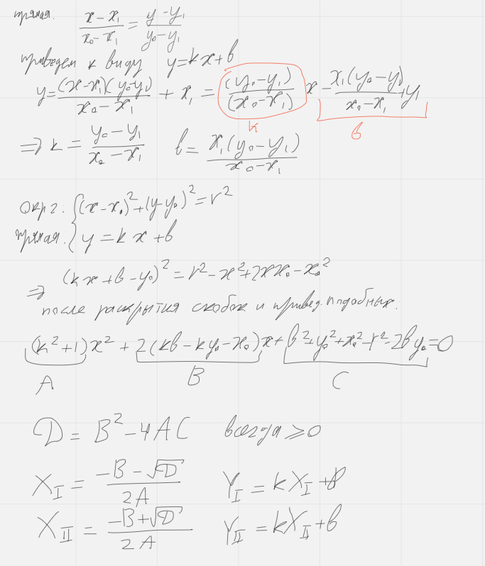

[Diagrams](https://miro.com/app/board/uXjVP6Rs0iE=/?share_link_id=364583998566)

## Отчет по курсовой работе по дисциплине «Алгоритмы и структуры данных»  
**Тема**: «Реализация алгоритма генерирования команд отрисовывания объектов двумерной графики».

**Исходные данные**: Файл двумерной графики в формате svg.  

### Формулировка задания.
Реализовать алгоритм генерирования команд отрисовывания объектов двумерной графики, заданных параметрически, таким образом чтобы минимизировать расстояния перемещения поднятой “кисти”.
В качестве языка команд использовать gcode, в качестве входных данных двумерной графики - файлы svg.

Контрольный пример.  
**Входные данные**: svg - файл

<svg width="195" height="195" xmlns="http://www.w3.org/2000/svg">
    <line x1="60" y1="80" x2="60" y2="20" stroke="red" />
    <line x1="100" y1="80" x2="100" y2="20" stroke="red" />
    <line x1="40" y1="130" x2="30" y2="100" stroke="red" />
    <line x1="120" y1="130" x2="130" y2="100" stroke="red" />
    <line x1="115" y1="130" x2="45" y2="130" stroke="red" />
</svg>

**Выходные данные**: Gcode - файл  

G28  
G1 X70.300000Z3 F5000.0  
G1 X70.300000 Y60.300000 Z0 F5000.0  

;SEGMENT  
G1 Z5 F3000  
; move to point (60:20)  
G1 X175 Y215 F3000  
G1 Z0 F3000  
G1 X175 Y155 F3000; draw  

;RECT  
G1 Z5 F3000  
; move to point (120:100)  
G1 X115 Y135 F3000  
G1 Z0 F3000  
G1 X115 Y125 F3000; draw  
G1 X175 Y125 F3000; draw  
G1 X175 Y135 F3000; draw  
G1 X115 Y135 F3000; draw  

;SEGMENT  
G1 Z5 F3000  
; move to point (100:80)  
G1 X135 Y155 F3000  
G1 Z0 F3000  
G1 X135 Y215 F3000; draw  
G1 Z5 F3000  

G1 X70 Y60 F5000.0  
G1 X0 Y0  

### Теоретические сведения.
Структура документа SVG.  
Ниже приведены основные сведения о тэгах формата svg, с которыми работает алгоритм.

- \<circle cx= “50” cy=”30” r=”80”/>
- \<ellipse cx="100" cy="50" rx="100" ry="50" />
- \<line x1="0" y1="80" x2="100" y2="20" stroke="black" />

Требования к svg файлу:
* содержит ровно один, закрытый тег svg с ненулевыми параметрами width и height.
* в этом теге есть хотябы один элемент из поддерживаемых (см выше)
* размер svg элемента не превышает размеры области печати в мм (165х175).

GCode  
G-код - это язык программирования устройств с числовым программным управлением (ЧПУ).  
Ниже описаны основные команды языка gcode, с которыми работает алгоритм.

G28 ; переместиться в начальную позицию  
G0 F1500 ; утсановить скорость перемещения g0 - холостое перемещение  
G1 X0.1 Y20 Z0.3 ; g1 - линейное перемещение  

### Модульная организация проекта.
Проект имеет четыре основных модуля: Svg, Gcode, Algorithm и Figures.  

Модуль Figures предоставляет такие типы как Point, SlicedFig, также абстрактный тип Figure, который наследуют типы Circle, Rect и Segment. Также модуль предоставляет функции нахождения расстояния между фигурами, точки пересечения прямых и т. д. Эти типы используются во всех остальных модулях.  

Модуль (класс) Svg предназначен для парсинга svg файла. По окончанию парсинга файла он владеет таким ресурсом, как std::vector всех фигур m_figures. И предоставляет доступ к нему через методы begin и end, которые возвращают итераторы начала и конца m_figures и метод get(int n), возвращающий m_figures[n] по значению.  

Модуль (класс) Algorithm содержит основную логику работы программы. Он имеет поля типа Svg, Gcode, а также вспомогательные поля для хранения данных и промежуточных представлений фигур. Весь алгоритм разделен на закрытые методы, для правильного порядка их вызова предоставлен публичный метод start():  

<code>  
void start(const std::string &svgFilePath, const std::string &gcodeFilePath) {  
    svg.empty();  
    svg.parse(svgFilePath);  
    drawParsed();  
    std::cout << svg;  
    setFiguresDrawingOrder();  
    setFiguresSlicePoints();  
    drawPath();  
    sliceFigures();  
    gcode.generateGcode(gcodeFilePath, m_slicedFigures);  
}
</code>

Методы *drawParsed* и *drawPath* используя библиотеку sfml схематично отрисовывают фигуры после парсинга и фигуры с линиями перемещения поднятой кисти соответственно.  

Метод *setFiguresDrawingOrder* записывает оптимальный порядок фигур отрисовывания фигур в структуру данных типа std::vector<int>.  

Метод *setFiguresSlicePoints* обнаруживает для каждой пары фигур в порядке обхода ближайшие точки и записывает их в поле типа std::vector<std::pair<fig::Point, fig::Point>> m_figSlicePoints.  

Метод *sliceFigures* создает массивы координат точек, которые будет использовать объект типа Gcode для генерации команд отрисовки для каждой фигуры в порядке, задаваемом  m_figDrawingOrder и записывает их в std::vector, используя тип fig::slicedFig (описанный в модуле Figure) как обёртку над эти массивом.  

Модуль Gcode предназначен для записи команд на языке gcode в файл. У него есть один главный публичный метод generateGcode, который принимает путь к файлу и std::vector<fig::slicedFig>. Для каждой фигуры  

### Описание алгоритмов программы.  

В ходе написания курсовой работы были реализованы многие геометрические алгоритмы, такие как алгоритм нахождения кратчайшего расстояния между прямой и точкой, между двумя точками, между прямой и окружность, между прямоугольником и точкой и т.д,алгоритмы нахождения ближайших точек между фигурами, алгоритмы нахождения точек пересечения фигур.  

Приведём математическое обоснование алгоритма обнаружения кратчайшего пути между двумя окружностями.  

Алгоритмы *getNearestPoint(figVarians, figVariants)*.  

Для случая двух окружностей задача сводится к нахождению точек пересечения отрезка на центрах окружностей и второй окружности.  

  

Дано: x1, y1, x0, y0, r  
Найти: X,Y  
Решение:  

Далее по алгоритму проверки принадлежности точки отрезку (pointBelongs для класса Segment) выбирается нужная пара значений X,Y  

### Пример работы программы.  
Input.svg (рис. ):  

<svg width="800" height="600" xmlns="http://www.w3.org/2000/svg">

<line y2="295" x2="182" y1="320" x1="259" stroke="#000" fill="none"/>
    <line y2="435" x2="207" y1="304" x1="170" stroke="#000" fill="none"/>
    <line y2="325" x2="686" y1="349" x1="576" stroke="#000" fill="none"/>
    <line y2="466" x2="652" y1="333" x1="699" stroke="#000" fill="none"/>
    <line y2="469" x2="154" y1="453" x1="195" stroke="#000" fill="none"/>
    <line y2="505" x2="235" y1="452" x1="210" stroke="#000" fill="none"/>
    <line y2="508" x2="620" y1="480" x1="634" stroke="#000" fill="none"/>
    <line y2="514" x2="701" y1="480" x1="651" stroke="#000" fill="none"/>
    <line y2="469" x2="579" y1="460" x1="625" stroke="#000" fill="none"/>
    <line y2="456" x2="284" y1="446" x1="233" stroke="#000" fill="none"/>
    <line y2="96" x2="623" y1="179" x1="573" stroke="#000" fill="none"/>
    <line y2="192" x2="686" y1="95" x1="640" stroke="#000" fill="none"/>
    <line y2="110" x2="235" y1="182" x1="281" stroke="#000" fill="none"/>
    <line y2="187" x2="171" y1="111" x1="216" stroke="#000" fill="none"/>
    <line y2="220" x2="126" y1="201" x1="157" stroke="#000" fill="none"/>
    <line y2="211" x2="217" y1="200" x1="179" stroke="#000" fill="none"/>
    <line y2="237" x2="170" y1="206" x1="167" stroke="#000" fill="none"/>
    <line y2="220" x2="640" y1="201" x1="668" stroke="#000" fill="none"/>
    <line y2="234" x2="679" y1="207" x1="679" stroke="#000" fill="none"/>
    <line y2="221" x2="731" y1="202" x1="697" stroke="#000" fill="none"/>
    <circle r="22" cy="327" cx="376" stroke="#000" fill="#fff"/>
    <circle r="22" cy="326" cx="491" stroke="#000" fill="#fff"/>
    <line y2="248" x2="431" y1="158" x1="426" stroke="#000" fill="none"/>
    <line y2="228" x2="408" y1="163" x1="382" stroke="#000" fill="none"/>
    <line y2="225" x2="445" y1="164" x1="464" stroke="#000" fill="none"/>
    <line y2="398" x2="500" y1="402" x1="366" stroke="#000" fill="none"/>
    <line y2="387" x2="419" y1="367" x1="419" stroke="#000" fill="none"/>
    <line y2="385" x2="445" y1="368" x1="443" stroke="#000" fill="none"/>
    <line y2="260" x2="295" y1="138" x1="349" stroke="#000" fill="none"/>
    <line y2="126" x2="474" y1="132" x1="364" stroke="#000" fill="none"/>
    <line y2="228" x2="566" y1="129" x1="504" stroke="#000" fill="none"/>
    <line y2="371" x2="553" y1="253" x1="573" stroke="#000" fill="none"/>
    <line y2="424" x2="327" y1="296" x1="291" stroke="#000" fill="none"/>
    <line y2="456" x2="443" y1="435" x1="343" stroke="#000" fill="none"/>
    <line y2="431" x2="539" y1="453" x1="458" stroke="#000" fill="none"/>
    <line y2="382" x2="556" y1="418" x1="551" stroke="#000" fill="none"/>
    <line y2="288" x2="359" y1="314" x1="338" stroke="#000" fill="none"/>
    <line y2="284" x2="397" y1="284" x1="372" stroke="#000" fill="none"/>
    <line y2="324" x2="417" y1="296" x1="408" stroke="#000" fill="none"/>
    <line y2="293" x2="471" y1="320" x1="455" stroke="#000" fill="none"/>
    <line y2="288" x2="513" y1="288" x1="486" stroke="#000" fill="none"/>
    <line y2="330" x2="537" y1="293" x1="526" stroke="#000" fill="none"/>
    <line y2="363" x2="475" y1="334" x1="455" stroke="#000" fill="none"/>
    <line y2="366" x2="506" y1="363" x1="487" stroke="#000" fill="none"/>
    <line y2="342" x2="539" y1="358" x1="526" stroke="#000" fill="none"/>
    <line y2="354" x2="346" y1="326" x1="336" stroke="#000" fill="none"/>
    <line y2="364" x2="394" y1="363" x1="361" stroke="#000" fill="none"/>
    <line y2="358" x2="406" y1="333" x1="419" stroke="#000" fill="none"/>
</svg>

[Видео работы 3д-принтера.](https://drive.google.com/drive/folders/1rzjhh-ar8s1D99xpTaAS9UHQoWeKxjM8)  

**Output.gcode**  

G28 ; calibration  
G1 X70.300000Z3 F5000.0  
G1 X70.300000 Y60.300000 Z0 F5000.0 ; Move to start position  

;SEGMENT  
G1 Z5 F3000  
; move to point (576:349)  
G1 X116.2 Y139.025 F3000  
G1 Z0 F3000  
G1 X93.5125 Y145.625 F3000; draw  

…

;SEGMENT  
G1 Z5 F3000  
; move to point (361:363)  
G1 X160.544 Y135.175 F3000  
G1 Z0 F3000  
G1 X153.738 Y134.9 F3000; draw  

;CIRCLE  
G1 Z5 F3000  
; move to point (398:327)  
G1 X152.913 Y145.075 F3000  
G1 Z0 F3000  
G1 X153.003 Y143.871 F3000; draw  
…  
G1 X152.913 Y145.075 F3000; draw  

;SEGMENT  
G1 Z5 F3000  
; move to point (366:402)  
G1 X159.512 Y124.45 F3000  
G1 Z0 F3000  
G1 X131.875 Y125.55 F3000; draw  
…  
 
;SEGMENT  
G1 Z5 F3000  
; move to point (431:248)  
G1 X146.106 Y166.8 F3000  
G1 Z0 F3000  
G1 X147.137 Y191.55 F3000; draw  

…  

G1 X70 Y60 F5000.0  
G1 X0 Y0  